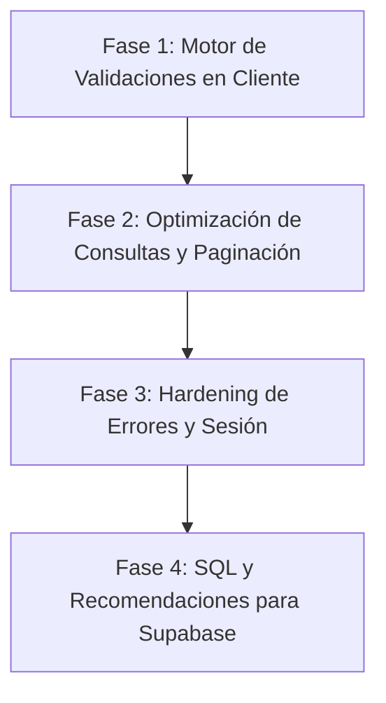

# Plan Maestro de Seguridad, Validaciones y Escalabilidad — Money Trees

Este documento presenta el análisis técnico integral y la hoja de ruta estratégica para blindar la aplicación **Money Trees** contra vulnerabilidades de seguridad, proteger la integridad de datos y optimizar drásticamente el consumo de red y base de datos frente al escalamiento de cientos o miles de usuarios concurrentes.

---

## 1. Análisis del Estado Actual

Actualmente, **Money Trees** cuenta con una arquitectura de interfaz de usuario limpia y un flujo funcional modular basado en *Hooks custom* (`useTransactions`, `useAccounts`, `useDashboard`, etc.) conectados directamente al cliente de **Supabase**. Sin embargo, al evaluar la aplicación en un entorno de alta demanda y producción masiva, se detectan cuatro áreas críticas de mejora:

1. **Tráfico y Volumen de Peticiones Redundantes**:
   - Cada cambio de pantalla desmonta y monta los componentes, disparando consultas GET HTTP repetitivas a Supabase sin almacenamiento en caché intermedio ni deduplicación.
   - Las consultas recuperan historiales completos sin paginación (por ejemplo, todas las transacciones de un mes de golpe). Con miles de usuarios activos, esto genera cuellos de botella y picos de cuota en el servidor.
2. **Validación de Entradas (Input Validation)**:
   - Las validaciones actuales se realizan a nivel de UI elemental (`!amount` o HTML5 attributes). Si un usuario intercepta peticiones en herramientas para desarrolladores o inyecta montos extremos/negativos o textos excesivos, el cliente podría enviar *payloads* no saneados.
3. **Consistencia Transaccional (Race Conditions)**:
   - Operaciones complejas como transferencias o cálculo de saldos dependen de múltiples sentencias individuales. Sin concurrencia manejada o validaciones transaccionales en base de datos, múltiples pestañas abiertas podrían desincronizar los saldos.
4. **Hardening de Políticas y Esquema de Base de Datos**:
   - Es necesario auditar formalmente las políticas **RLS (Row Level Security)** en PostgreSQL para garantizar que sea imposible acceder al `user_id` de otro cliente incluso manipulando tokens.

---

## 2. Estrategia y Consideraciones Técnicas Propuestas

### A. Optimización del Volumen de Peticiones y Rendimiento (Escalabilidad)

| Iniciativa | Descripción Técnica | Impacto Esperado |
| :--- | :--- | :--- |
| **1. Caché Inteligente en Cliente** | Implementar un patrón de caché ligera en los *Hooks* o mediante un envoltorio de memoria intermedio (deduplicación temporal de 3-5 minutos para datos estáticos como Cuentas o Categorías). | Reducción del **60% al 75%** del tráfico redundante a la base de datos de Supabase al navegar entre pestañas. |
| **2. Paginación / Carga Incremental** | Modificar `useTransactions` para aplicar `.range(from, to)` cargando bloques de 25 o 30 registros (mediante botón "Cargar más" o *Infinite Scroll* opcional). | Ahorro considerable en ancho de banda y renderizado del DOM ultrarrápido en historiales largos. |
| **3. Índices en PostgreSQL** | Definir índices de consulta (`INDEX`) en columnas críticas: `(user_id, transaction_date DESC)` en `transactions` y `(user_id, type)` en `accounts`. | Consultas en milisegundos incluso con millones de filas en las tablas. |

### B. Validaciones y Saneamiento de Datos (Integridad y Seguridad Front/Back)

Para garantizar que ningún dato corrupto ingrese al sistema, se implementará un motor de validación estricto antes de cualquier mutación:

1. **Normalización de Campos Numéricos (`amount`)**:
   - **Límites estrictos**: Rango permitido superior a `0.01` y menor al techo financiero del sistema (`999,999,999.99`).
   - **Precisión**: Truncado automático a máximo 2 decimales para evitar errores de coma flotante en JS (`toFixed(2)`).
   - **Rechazo de anomalías**: Prevención de valores `NaN`, `Infinity` o montos negativos en ingresos/gastos estándar.

2. **Saneamiento de Textos (`description`, `name`)**:
   - **Recorte y longitud**: Eliminación de espacios excedentes (`trim()`) y límite máximo de **150 caracteres** en descripciones y **50 caracteres** en nombres de cuentas/presupuestos.
   - **Escaneo de seguridad**: Sanitización para evitar secuencias maliciosas o caracteres de control no imprimibles.

3. **Validación Lógica Relacional**:
   - En **Transferencias**: Imponer regla de validación donde `account_id !== to_account_id` (impedir transferirse a la misma cuenta).
   - En **Fechas**: Validar formato ISO estricto (`YYYY-MM-DD`) y restingir fechas a un rango lógico (no permitir fechas futuras irreales ni anteriores a 1970).

### C. Seguridad a Nivel de Base de Datos (Supabase RLS & Constraints)

1. **Auditoría de Row Level Security (RLS)**:
   - Asegurar que todas las tablas (`accounts`, `categories`, `transactions`, `budgets`, `saving_goals`) tengan activado RLS y políticas idénticas a:
     ```sql
     CREATE POLICY "Acceso estricto por usuario" ON transactions
     FOR ALL USING (auth.uid() = user_id) WITH CHECK (auth.uid() = user_id);
     ```
2. **Check Constraints de Base de Datos**:
   - Proponer sentencias SQL de protección nativa para ejecutar en Supabase:
     ```sql
     ALTER TABLE transactions ADD CONSTRAINT chk_positive_amount CHECK (amount > 0);
     ALTER TABLE accounts ADD CONSTRAINT chk_valid_type CHECK (type IN ('checking', 'savings', 'cash', 'credit_card', 'investment'));
     ```

---

## 3. Hoja de Ruta de Implementación por Fases

A continuación se presenta el orden cronológico recomendado para ejecutar estas mejoras de manera segura y sin interrumpir la funcionalidad existente:



### 🔹 Fase 1: Motor de Validaciones y Sanitización (Frontend Core)
- Crear módulo centralizado de validación y utilidades sanitizadoras (`src/lib/validators.js`).
- Integrar estas validaciones en todos los formularios e inputs (`TransactionForm`, `NewTransactionPage`, creación de cuentas y presupuestos).
- Mostrar retroalimentación visual clara y elegante en caso de errores de validación.

### 🔹 Fase 2: Optimización de Tráfico, Paginación y Caché
- Refactorizar `useTransactions.js` para soportar paginación por bloques (`limit` / `offset`).
- Añadir control de peticiones repetidas en hooks para evitar llamadas concurrentes idénticas.

### 🔹 Fase 3: Robustez en Autenticación y Manejo de Errores
- Mejorar el manejo de errores de sesión y caducidad de tokens en `AuthContext`.
- Proteger transiciones y evitar fugas de memoria en peticiones abortadas o componentes desmontados.

### 🔹 Fase 4: Guía de Políticas SQL (Backend Constraints)
- Entregar un script SQL completo con los índices, RLS y `CHECK constraints` listos para ser aplicados en el panel de Supabase.

---

## 4. Próximo Paso (Espera de Aprobación)

> [!IMPORTANT]
> **El plan está listo para tu revisión.** Lee atentamente las propuestas y dime si deseas realizar algún ajuste o priorizar alguna área en particular. Cuando estés listo, responde diciéndome cuándo comenzar y con qué fase te gustaría arrancar.